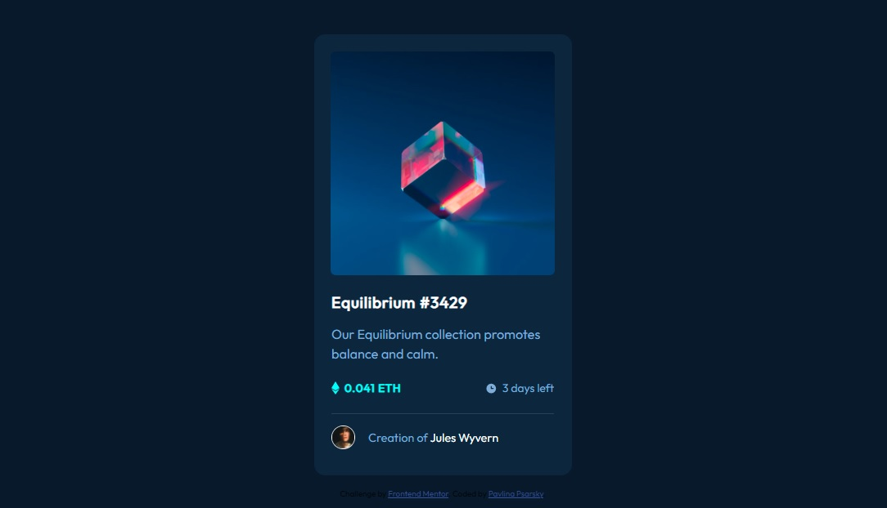
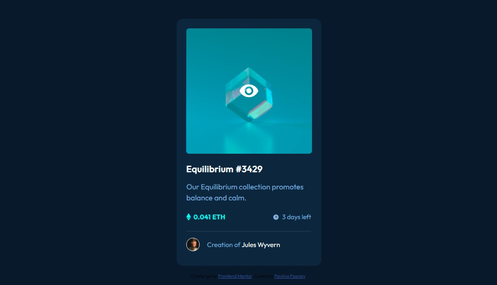

# Frontend Mentor - NFT preview card component solution

This is a solution to the [NFT preview card component challenge on Frontend Mentor](https://www.frontendmentor.io/challenges/nft-preview-card-component-SbdUL_w0U). Frontend Mentor challenges help you improve your coding skills by building realistic projects. 

## Table of contents

- [Overview](#overview)
  - [The challenge](#the-challenge)
  - [Screenshot](#screenshot)
  - [Links](#links)
- [My process](#my-process)
  - [Built with](#built-with)
  - [What I learned](#what-i-learned)
  - [Continued development](#continued-development)
  - [Useful resources](#useful-resources)
- [Author](#author)
- [Acknowledgments](#acknowledgments)

## Overview

### The challenge

Users should be able to:

- View the optimal layout depending on their device's screen size
- See hover states for interactive elements

### Screenshot

| Desktop layout |
|:--:|


| Desktop layout hover|
|:--:|


| Mobile layout |
|:--:|


### Links

- Solution URL: https://github.com/PavlinaPs/NFT-preview-card-component
- Live Site URL: https://pavlinaps.github.io/NFT-preview-card-component/

## My process

### Built with

- Semantic HTML5 markup
- CSS custom properties
- Flexbox
- Mobile-first workflow

### What I learned

Fist I tried to solve the image hover state by using z-index, but it didn't work out due to unexpected behaviour, at least for me as of now - some weird flashing occured.

Then I learned the hard way that there is a big difference in setting opacity:

```css
.div {
  opacity: 0.5;
}
```
and
```css
.div {
  background-color: hsl(178, 100%, 50%, 0.45);
}
```
I find this challenge very useful for me.

### Continued development

I need to practice a lot to get faster.

### Useful resources

When deciding how to make the horizontal line - with \<hr> element or a \<div> I checked out these two pages:
- [\<hr>: The Thematic Break (Horizontal Rule) element](https://developer.mozilla.org/en-US/docs/Web/HTML/Element/hr) on MDN
- [How to make a horizontal line without using \<hr> tag?](https://stackoverflow.com/questions/68442307/how-to-make-a-horizontal-line-without-using-hr-tag) - a nice summary on Stack Overflow (\<hr>, \<div>, pseudo class)

## Author

- GitHub - [PavlinaPs](https://github.com/PavlinaPs)
- Frontend Mentor - [@PavlinaPs](https://www.frontendmentor.io/profile/PavlinaPs)

## Acknowledgments

It is great that I can solve Frontend Mentor's challenges. They are all very useful for me. Thank you!
